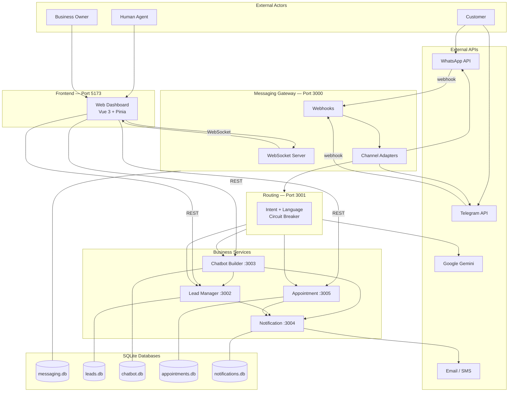

# Full Architecture Diagram

Omnichannel Lead Management Platform — complete architecture reference.

---

## How to view / export

1. Open [mermaid.live](https://mermaid.live)
2. Paste contents of:
   - `diagrams/architecture-full.mmd` — **full system diagram**
   - `diagrams/sequence-incoming-message.mmd` — **message flow sequence**
   - `diagrams/architecture.mmd` — **simple version** (slides)
3. Export as **PNG** or **SVG** for slides/reports

---

## 1. Full System Architecture (Mermaid)



> For the **detailed version** with all sub-components, use `diagrams/architecture-full.mmd`.

---

## 2. Layered Architecture (ASCII)

```
┌─────────────────────────────────────────────────────────────────────────────┐
│                           EXTERNAL ACTORS                                    │
│   Customer (WhatsApp/Telegram/Web)    Agent/Staff    Business Owner         │
└───────────────┬─────────────────────────────┬───────────────────────────────┘
                │                             │
                ▼                             ▼
┌───────────────────────────┐   ┌─────────────────────────────────────────────┐
│   EXTERNAL APIs           │   │         FRONTEND — Web Dashboard :5173       │
│   WhatsApp Business API   │   │   Vue 3 + Pinia + Vite                       │
│   Telegram Bot API        │   │  ┌──────────┐ ┌──────────┐ ┌─────────────┐  │
│   Google Gemini API       │   │  │  Agent   │ │   Lead   │ │  Analytics  │  │
│   SMTP / SMS Gateway      │   │  │ Console  │ │  Mgmt UI │ │  Dashboard  │  │
└─────────────┬─────────────┘   │  └──────────┘ └──────────┘ └─────────────┘  │
              │                 │         REST APIs  │  WebSocket               │
              │ webhook         └──────────┬─────────┴──────────────────────────┘
              ▼                            │
┌─────────────────────────────────────────┴───────────────────────────────────┐
│              MESSAGING GATEWAY :3000  (ORCHESTRATOR)                          │
│  ┌─────────────┐  ┌─────────────────┐  ┌─────────────────────────────────┐  │
│  │  Webhooks   │  │ Platform        │  │  WebSocket Server               │  │
│  │  Receivers  │  │ Adapters        │  │  (real-time → dashboard)        │  │
│  └─────────────┘  └─────────────────┘  └─────────────────────────────────┘  │
│                          messaging.db (SQLite)                               │
└─────────────────────────────────┬───────────────────────────────────────────┘
                                  │ HTTP POST /route
                                  ▼
┌─────────────────────────────────────────────────────────────────────────────┐
│                    ROUTING SERVICE :3001                                     │
│   Gemini AI → Intent Classification → Language Detection → Circuit Breaker   │
└──────────┬──────────────────────┬──────────────────────┬─────────────────────┘
           │                      │                      │
           ▼                      ▼                      ▼
┌──────────────────┐  ┌──────────────────┐  ┌──────────────────────────────┐
│ CHATBOT BUILDER  │  │  LEAD MANAGER    │  │   APPOINTMENT SERVICE :3005  │
│     :3003        │  │     :3002        │  │   Scheduling · Availability  │
│ Flow Engine      │  │ CRUD · Scoring   │  │   Reminders                  │
│ Sector Templates │  │ Assignment       │  │                              │
│   chatbot.db     │  │ Status Lifecycle │  │      appointments.db           │
└────────┬─────────┘  │   leads.db       │  └──────────────┬───────────────┘
         │            └────────┬─────────┘                 │
         └─────────────────────┼───────────────────────────┘
                               ▼
         ┌─────────────────────────────────────────────────┐
         │       NOTIFICATION SERVICE :3004                 │
         │   Email Adapter │ SMS Adapter │ Push Adapter     │
         │              notifications.db                    │
         └─────────────────────────────────────────────────┘

┌─────────────────────────────────────────────────────────────────────────────┐
│                    DEPLOYMENT — Docker Compose                               │
│   Bun + Elysia.js + TypeScript │ Each service = separate container          │
└─────────────────────────────────────────────────────────────────────────────┘
```

---

## 3. Service Summary

| Service | Port | Role | Database |
|---------|------|------|----------|
| Messaging Gateway | 3000 | Orchestrator — webhooks, adapters, WebSocket | messaging.db |
| Routing Service | 3001 | AI intent routing (Gemini) | — |
| Lead Manager | 3002 | Lead CRUD, scoring, status, assignment | leads.db |
| Chatbot Builder | 3003 | Flow engine, sector templates | chatbot.db |
| Notification Service | 3004 | Email, SMS, push alerts | notifications.db |
| Appointment Service | 3005 | Scheduling, availability, reminders | appointments.db |
| Web Dashboard | 5173 | Agent UI, analytics, config | — |

---

## 4. Communication Types

| From | To | Protocol | Purpose |
|------|-----|----------|---------|
| Customer | Gateway | Webhook (via WA/TG API) | Incoming message |
| Gateway | Routing | REST HTTP | Classify intent |
| Gateway | Chatbot / Lead / Appointment | REST HTTP | Business logic |
| Gateway | Notification | REST HTTP | Trigger alerts |
| Gateway | Dashboard | WebSocket | Real-time updates |
| Dashboard | Gateway | WebSocket | Agent reply |
| Dashboard | Lead / Chatbot / Appointment | REST HTTP | CRUD, config, reports |
| Routing | Gemini | HTTPS API | Intent classification |

---

## 5. Multi-Tenancy

Every table includes `business_id`. All queries filter by tenant — Business A cannot access Business B data.

---

## 6. Files

| File | Use |
|------|-----|
| `diagrams/architecture-full.mmd` | Full diagram for reports |
| `diagrams/architecture.mmd` | Simple diagram for slides |
| `diagrams/sequence-incoming-message.mmd` | Sequence diagram for mentor demo |
| `platform-docs/ARCHITECTURE.md` (in `omnichannel-backend/docs/`) | Full technical documentation |
